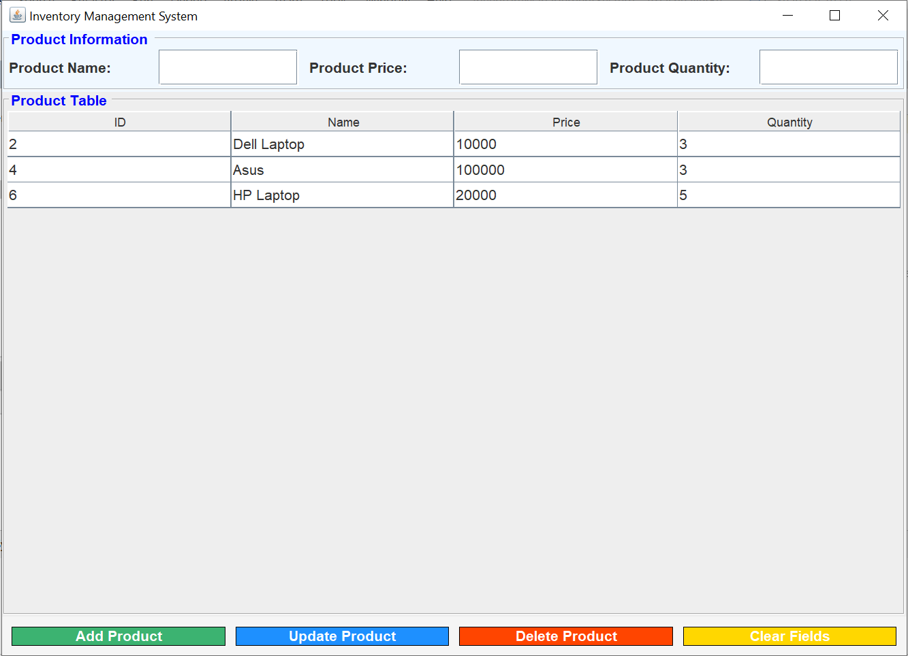

# Inventory-Management-System
A simple inventory management system built in Java using JDBC for database interaction and Java Swing for the user interface. This application allows users to manage product information such as name, price, and quantity. It supports basic CRUD (Create, Read, Update, Delete) operations.

## Features
- Add new products
- Update existing product information
- Delete products from the inventory
- View all products in a table format
- Clean and user-friendly interface built with Java Swing

## Technologies Used
- **Java**: Core programming language
- **JDBC (Java Database Connectivity)**: For connecting to MySQL database
- **MySQL**: For storing product data
- **Java Swing**: For creating the graphical user interface (GUI)

## Getting Started

### Prerequisites
- JDK 8 or higher
- MySQL server
- IDE such as IntelliJ IDEA, Eclipse, or NetBeans
- MySQL Connector JAR for connecting Java with MySQL

### Installing

#### Clone the Repository
Clone the repository to your local machine:
```bash
git clone https://github.com/Rafay-Memon/Inventory-Management-System.git
```
#### Database Setup

1. **Download and Install [MySQL](https://dev.mysql.com/downloads/installer/).**

2. **Create a new database named productdb:**

``` sql
CREATE DATABASE productdb;
```
3. **Create a table for storing product information:**

```sql
CREATE TABLE product (
    pid INT AUTO_INCREMENT PRIMARY KEY,
    pname VARCHAR(100),
    pprice INT,
    pqty INT
);
```

4. **Update the database credentials in the `ConnectionProvider.java` file to match your MySQL configuration:**

```java
private static final String URL = "jdbc:mysql://localhost:3306/productdb";
private static final String USER = "yourusername";
private static final String PASSWORD = "yourpassword";
```

#### Running the Application
1. Open the project in your favorite IDE.
2. Run the `MainApp.java` class to launch the application.

## Usage
- The application displays a form where you can input product details such as name, price, and quantity.
- You can add, update, or delete products.
- A table below the form displays the list of products

## Screenshots


## Contributing
Feel free to fork this repository and submit pull requests. For bug fixes or new features, create a new branch and describe the changes you’ve made in your pull request.

## Acknowledgments
- [Java](https://www.oracle.com/java/)
- [MySQL](https://www.mysql.com/)
- [Java Swing](https://docs.oracle.com/javase/8/docs/technotes/guides/swing/)
- [GitHub](https://github.com/)
